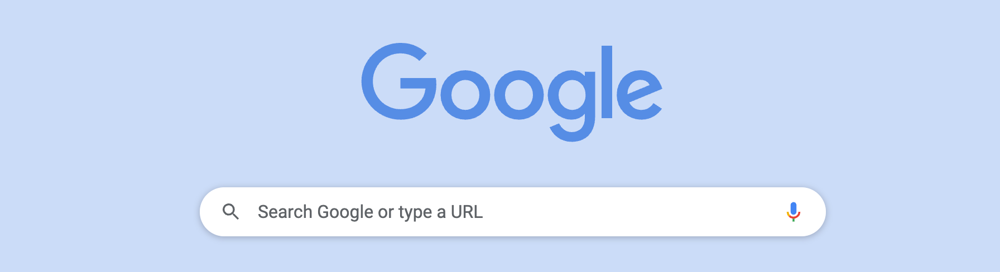

---
tags:
  - Demo
  - Getting started
---

# JS201 - Advanced Javascript

## Learning Objectives for the block:

### Sprint-1

<details> <summary>Class-1 - Essential Javascript Concepts - I</summary>

- Setting expectations & Block introduction
- scopes
- hoisting
- `let`, `var`, `const`
- `null`, `undefinded` & the temporal dead zone
- difference in the way primitives & non-primitives are stored internally
- Introduction to CP

</details>


<details> <summary>Class-2 - Essential Javascript Concepts - II</summary>

- statements vs expressions
- template string
- logical operators
- arrow functions
- destructuring
- rest & spred operator
- ES6 modules
- for .. of loop
- for .. in loop

</details>

<details> <summary>Class-3 - Array methods in depth - I</summary>

- Prerequisites - Array methods
- Map()
- The concept of hash maps
- Reduce()
- Filter()

</details>

<details> <summary>Class-4 - Array methods in depth - II</summary>

- Sort()
- Practice complicated exercises (We tasks)

</details>

### Sprint-2

<details> <summary>Class-5 - Functions & Objects in depth</summary>

- Declaring & Accessing properties
- Invoking methods
- Dynamic property names
- Object.assign
- Object.create
- Object.setPrototypeOf
- Invoking functions
  - ()
  - call
  - bind
  - apply
- Constructing objects in Bulk

</details>

<details> <summary>Class-6 - Prototypical Inheritance - I</summary>

- Factory functions

</details>

<details> <summary>Class-7 - Prototypical Inheritance - II</summary>

- Constructor functions
- ES6 Classes
- LLD

</details>

<details> <summary>Class-8 - Mastering the this keyword</summary>

- The `this` keyword

</details>

### Sprint-3

<details> <summary>Class-9 - Asynchronous Javascript - I</summary>

- promises
- callbacks
- async await
- CRUD

</details>

<details> <summary>Class-10 -  Asynchronous Javascript - II</summary>

- `JWT` Authentication
- Registering users
- Logging in users
- Making authenticated requests

</details>

<details> <summary>Asynchronous Javascript - III</summary>

- Sending data with links
- Better organising & planning of code
- Working effectively with codes
- Different ways of implementing sorting and filtering

</details>

<details> <summary>Class-11 -  Asynchronous Javascript - III</summary>

- Pagination
- Misc. topics

</details>

### Sprint-4 \[Mid Term Revision\]

<details> <summary>Revision Class - 1 & 2</summary>

- currying
- Async prog - event loop
- Event capturing / bubbling
- Flatten an array
- debouncing
- Throttling
- Their own higher order
  - build your own reduce, forEach etc.

</details>

---

:::caution

This **document** is _work in_ `progress`. For **demo** only.

:::

---

## Resources \[table format\]


| Resource             | Links                                                                              |
| :--------------------- | :----------------------------------------------------------------------------------- |
| Pre-class Video      | https://course.masaischool.com/lectures/48260                                      |
| Live-class Recording | https://course.masaischool.com/lectures/48284                                      |
| Assignment           | https://course.masaischool.com/assignments/21665                                   |
| Quiz                 | none                                                                               |
| Review Form          | https://docs.google.com/forms/d/1IBCwA6li-\_Mz_BIWiRyT2WayWctioT6v0sRbK2XczHQ/edit |

## Class wise Resources

###

This is my **first Docusaurus doc**!

import Tabs from '@theme/Tabs';
import TabItem from '@theme/TabItem';

<Tabs>
<TabItem value="sp-1" label="Sprint-1" default>
This is an apple 🍎
</TabItem>
<TabItem value="sp-2" label="Sprint-2">
This is an orange 🍊
</TabItem>
<TabItem value="sp-3" label="Sprint-3">
This is a banana 🍌
</TabItem>
<TabItem value="sp-4" label="Sprint-4 \[MTR\]">
This is a banana 🍌
</TabItem>
</Tabs>

```jsx title="/src/components/HelloCodeTitle.js"
function HelloCodeTitle(props) {
  return <h1>Hello, {props.name}</h1>;
}
```

:::note

Some **content** with _Markdown_ `syntax`. Check [this ](#)`api`.

:::

:::tip

Some **content** with _Markdown_ `syntax`. Check [this ](#)`api`.

:::

:::info

Some **content** with _Markdown_ `syntax`. Check [this ](#)`api`.

:::

:::caution

Some **content** with _Markdown_ `syntax`. Check [this ](#)`api`.

:::

:::danger

Some **content** with _Markdown_ `syntax`. Check [this ](#)`api`.

:::

<details>
<summary>1. Some details containing headings</summary>
<h2 id="#heading-id">I'm a heading that will not show up in the TOC</h2>

Some content...

</details>

<details> <summary>2. Some details containing headings</summary>

- one
- two
- three

</details>

- [URL path to another document](./installation)
- [file path to another document](./installation.mdx)


| one | two   | three | four | five |
| ----- | ------- | ------- | ------ | ------ |
| six | seven | eight | nine | ten  |
|     |       |       |      |      |
|     |       |       |      |      |


|  Syntax  | Description |
| :---------: | ------------- |
|  Header  | Title       |
| Paragraph | Text        |

## Elements

### Snow

- [Wikipedia](http://this-is-a-very-long-url-for-information-about-snow.com)
- It falls down in winter!
- Attributes:
  - soft
  - damp
  - crystal-like
- Types:
  - powder snow
  - wet snow
  - lazy snow

## Frost

- [Knowledge Base](http://this-is-a-very-long-url-for-information-about-frost-and-the-winter-season.com)
- Sparkling and frozen!
- Attributes:
  - cold
  - grainy
- Types:
  - permafrost
  - hard rime
  - ground frost


* [ ] one
* [X] two
* [ ] three

> quote one





<columns color="gold">

- one
- two
- three

```
  let name = "Vivek";
```


simple text

</columns>

I can write **Markdown** alongside my _JSX_!